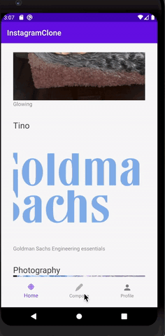
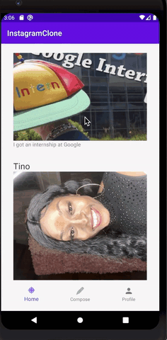

# Project 3 - *Instagram*

**Instagram** is a photo sharing app similar to Instagram but using Parse as its backend.

Time spent: **6** hours spent in total

## User Stories

The following **required** functionality is completed:

- [x] User can view the last 20 posts submitted to "Instagram".
- [x] The user should switch between different tabs - viewing all posts (feed view), compose (capture photos form camera) and profile tabs (posts made) using fragments and a Bottom Navigation View. (2 points)
- [x] User can pull to refresh the last 20 posts submitted to "Instagram".

## Video Walkthrough

Here's a walkthrough of implemented user stories:

## Notes

I will continue working on this and implement more Instagram feautures.
